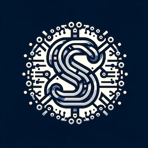
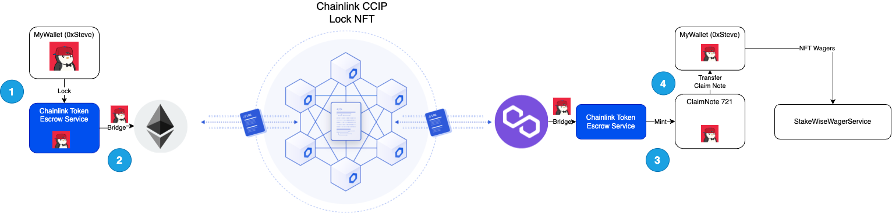
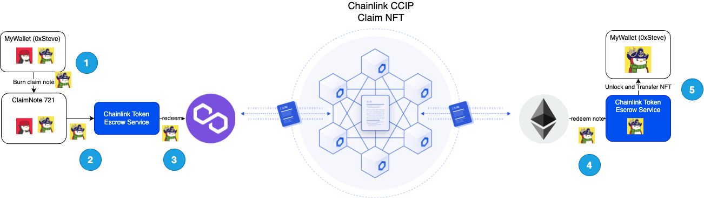
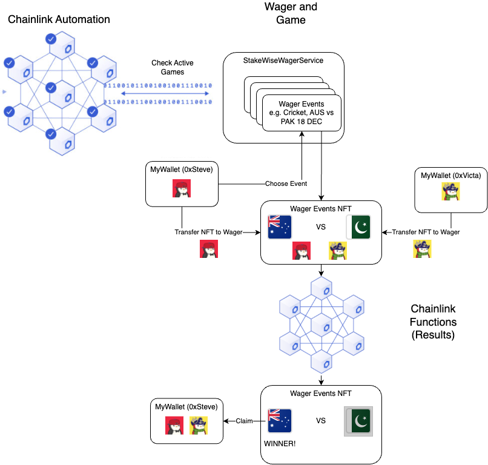

# SmartWager.Bet - Chainlink Constellation Hackathon (2023)
  
Stake your NFT, choose your wager and use the staked NFT as collateral.  
SmartWager allows you to bridge your NFTs onto the SmartWager platform, mint claim notes and use these notes to wager against various events.  

The SmartWager platform will automatically manage the wager, results, and disbursement. Each wager is represented by a dNFT, which holds the 
wager details and results. The dNFT is updated using Chainlink Automation and Chainlink VRF. Future automation will use real-world events.

## Transaction Records
**CCIP** -
- https://ccip.chain.link/msg/0xbfbbf3dca0538be4bf0df3e1d7dbe7b66e3d5e800b786f78dd74a2d0c15ad822 - After token mint, send it from Sepolia to Mumbai  
- https://ccip.chain.link/msg/0x8189d017cab27b3a414421faf1266811a0b472e20dcc09d02dcabb72ac4ba659 - Claim Note is burnt on Mumbai and NFT reclaimed on Sepolia side  

Here are a list of test CCIP messages which we've been sending:  
https://ccip.chain.link/address/0x9692f4a851175a86fa83cae65ead7e9629c1caf1

**Chainlink Functions** -   
 (ID 24285257907087691622817243027000637480036284087421225229913691001399631052684)
https://mumbai.polygonscan.com/tx/0xb9e618730dc075c8f2f518f783d80d1e3ebfb1d77bc52590a6da35093674d66c - Upkeep was performed when a wager result needed to be evaluated  

**Chainlink VRF** - 
(ID 6673)  
https://mumbai.polygonscan.com/tx/0xaeaf201f5be245cbed757003f6105ec9ab4acb325b93aa8a920427bcb52adb52 - When the above upkeep function called our platform, it generated a random number that was then used as a wager result between the players 

## Tech Stack
### Staking NFTs

Chainlink CCIP is the backbone of our NFT Token Escrow Service. We take advantage of the message transfer service to escrow NFTs between chains.  

- Steve wants to bring his NFT into the Polygon network. He wants to use the NFT in liquidity and speculation events on a low-cost network
- He transfers the NFT to the Chainlink Token Escrow  Service. A CCIP message is sent to the polygon network
- On polygon side, a ClaimNote is minted. Holder of this note can burn it to redeem the original NFT
- The ClaimNote is transferred automatically to Steve’s wallet on the Polygon Side   

### Claiming NFTs

Once the NFT is in Steve’s wallet he can start using the Smart Wager Service.   

- Steve sees a wager he likes and create a Wager Event (dNFT). He puts his claim note into the dNFT escrow. The wager event is published.  
- Victa sees this and decides to bet against Steve. He transfers his NFT into the Wager Event. 
- When the event completes, Chainlink Automation will wake up our smart contract who will then use Chainlink functions to retrieve the result of the wager. Both NFTs are automatically sent to Steve once we’ve confirmed that Steve is the winner. All in a trust-reduced environment.

### SmartWager Platform

Steve now wants to claim the NFT he won. It turns out Victa also used the CTES to send his NFT to Stakewise. Steve now holds the NFT Claim Note to the penguin on the original chain.  

- Steve calls claim on the note, burning it in the process
- CTES creates a CCIP message and sends it to the originating chain (it has all this information when it first mints the Claim Note)
- The redeem function is called and a message arrives on the originating chain.
- The redeem request is received and the token is then removed from escrow
- The NFT is finally sent to Steve who can now do anything with the NFT

## Setup

### Setup Blockchain
- cd sw-blockchain
- npm install
- npm run compile
- npx hardhat test

**Deploy the Escrow Services on multiple chains**
- npx hardhat run --network polygon_mumbai scripts/deployChainlinkTokenEscrowService.ts
- npx hardhat run --network sepolia scripts/deployChainlinkTokenEscrowService.ts

**Deploy the Smart Wager platform**
In the output, find the whitelist address and replace the whitelist inside deployStakeWiseInfrastructure.ts with the whitelist (shared whitelist)  

- npx hardhat run --network polygon_mumbai scripts/deployStakeWiseInfrastructure.ts

**Seed the Smart Wager platform with some events**
Edit the stakeWiseWagerServiceAddress address as per output above (deployStakeWiseInfrastructure) and reset the nftId variable to 0  
Seed it with some wagers  

- npx hardhat run --network polygon_mumbai scripts/operations/addAdditionalWagers.ts 

### Setup Frontend
- cd sw-frontend
- Edit .env file and add the wallet connect key
- npm install
- Edit the components/common/common.jsx with the newly deployed smart contracts above
- npm run dev

# Learn More  
Watch the video here https://www.youtube.com/watch?v=FTtOGKi1sdM

# Future Improvements and Next Steps
We're on the lookout for partners in Australia to take this to market. With some betting agencies already in mind, we're tapping into a huge potential. 🚀

Next steps:  
- **Build Out the Tech 🛠**: Ironing out the kinks.
- **Market Fit 🎲**: Experiment with different chains and find the sweet spot for our product.
- **Tokenomics 💰**: If we can nail the tokenomics and product market fit then the platform can run automatically forever (Chainlink products can be automatically funded)
- **Join Us! 👋**: Keen to learn more or help speed things up? Reach out here or find me on LinkedIn (search for Victa Phu).

Technical Improvements:
- Use TheGraph or an API to retrieve front-end data. This should greatly improve the scalability and responsiveness of the app  
- Make better use of the Chainlink Protocols (esp CCIP to optimise the costs). We want to explore multi-plexing the requests to allow users to transfer a batch of tokens in one CCIP message  
- Complete the UI components (claiming, cancelling) and allowing more than the ClaimToken as the wager NFT (e.g. enable various verified polygon NFTs to be used as wagers)
- Deploy this on other NFT-rich Blockchains so we can start to bridge these NFTs over to Polygon for wagering options
- Security audit of the smart contracts
